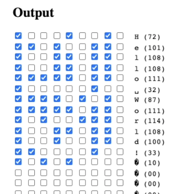
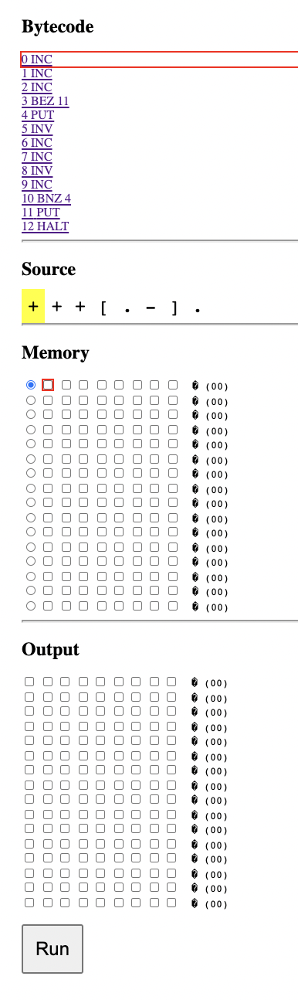
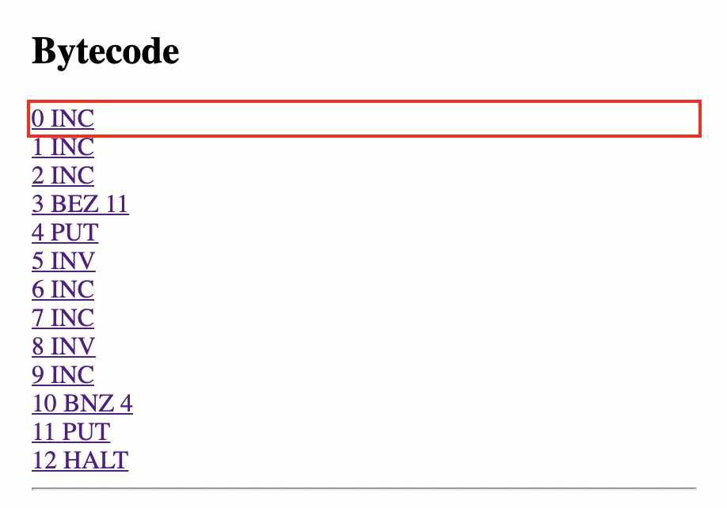
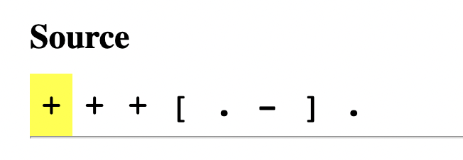
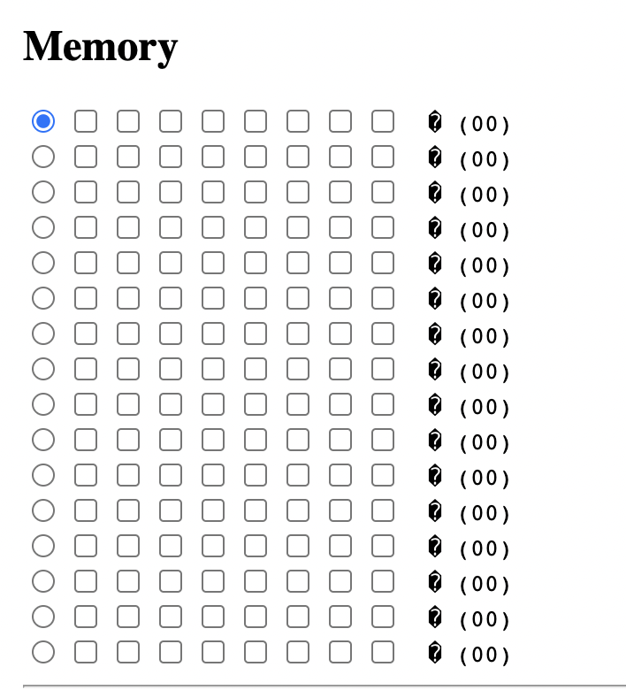
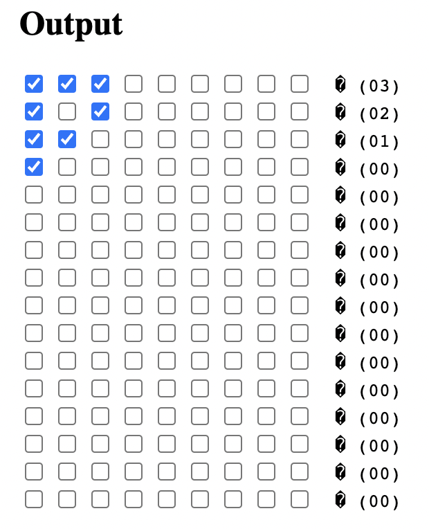

# BF-in-CSS

This project compiles a [Brainfuck](https://en.wikipedia.org/wiki/Brainfuck) program to static HTML and CSS.

The computation is encoded as a series of CSS rules, which highlight input elements on the page. Checkboxes are used as memory. Clicking on the highlighted elements in reverse-DOM order (i.e. bottom-to-top, right-to-left) advances the compuation.



[Click here to see it run "Hello World!"](https://github.com/mxmul/bf-in-css/blob/main/img/hello-world.webm) _(yes, it takes almost 4 minutes to run)_

## Usage

To start the development server, run:

```sh
$ npm run dev
```

You can begin execution by visiting [localhost:8080/#instruction-0](http://localhost:8080/#instruction-0) in Chrome[^1].

## FAQ

### Why does this exist?

I thought it was really cool when [HTML+CSS was shown to be Turing complete](http://lambda-the-ultimate.org/node/4222), and wanted to use that technique to run an actual recognizable program. Brainfuck is a not a very user friendly language, but it turns out it's way more practical to write a program for than [Rule 110](https://en.wikipedia.org/wiki/Rule_110).

### Is it really Turing complete?

Yes, with a big asterisk; some user interaction (i.e. clicking) _is_ required for the program to execute. This was also the case with the Rule 110 implementation.

The user isn't doing any of the _computation_ however – that all happens in CSS rules –  they just need to repeatedly click on the last red box. You could imagine an alternate stylesheet that hides all elements except the ones that you're meant to click, and expands those ones to totally fill the page; then, the user could just mindlessly click anywhere on the page to advance the computation.

### Hey! There's JavaScript on the page!

Yes, there's a little bit of JS, but it's not required for execution of the program. The "Run" button just automates clicking the red boxes very quickly. This speeds execution up considerable, and is mostly there to reduce RSI (fun fact: it takes 3813 clicks to run "Hello World!").

## How it Works

By default, we run a trivial Brainfuck program (but you can provide your own at `index.11ty.js:L12`):

```brainfuck
+++[.-].
```

This program counts down from three, printing out "3 2 1 0". In pseudo-code, it reads something like this:

```python
ptr = 0
# +++
memory[ptr] = 3
# [
while (memory[ptr] != 0):
    # .
    print(memory[ptr])
    # -
    memory[ptr] -= 1
# ]
```

And here it is in HTML + CSS:



The page is split up into a few visual sections. Here's a breakdown of how each of them work:

### Bytecode



Each Brainfuck instruction is compiled to a series of one or more simple "bytecode" instructions which we're able to more easily implement in HTML + CSS. These are all the instructions:

| Operator | Description                                                                         |
| -------- | ----------------------------------------------------------------------------------- |
| RIGHT    | Increment the data pointer (to point to the next cell to the right).                |
| LEFT     | Decrement the data pointer (to point to the next cell to the left).                 |
| INC      | Increment (increase by one) the byte at the data pointer.                           |
| INV      | Flip all bits of the byte at the data pointer.                                      |
| BNZ $A   | If the byte at the data pointer is non-zero, jump to instruction A. Otherwise noop. |
| BEZ $A   | If the byte at the data pointer is zero, jump to instruction A. Otherwise noop.     |
| PUT      | Output the byte at the data pointer.                                                |
| NOOP     | Does nothing.                                                                       |
| HALT     | Halt program execution.                                                             |

Many of these are self-explanatory, or map directly to Brainfuck operations. The branching instructions (`BNZ` and `BEZ`) allow us to simulate Brainfuck's loop operators without having to worry about nesting at runtime. We're able to use `INC` and `INV` together to simulate Brainfucks decrement operator, taking advantage of this bitwise trick:

```python
x - 1 == ~((~x + 1) + 1) + 1
```

The state of the instruction pointer is stored in the URL as a fragment identifier (hence the `#instruction-0` to start execution). Using the `:target` pseudo selector, we're able to both highlight the current instruction and adjust the styling of all inputs that follow (e.g. `[data-instruction=INC]:target ~ input`). This allows for different behavior depending on the position of the instruction pointer.

### Source



This is a visual representation of the original Brainfuck sourcecode. It's not actually needed for computation, but is useful for debugging program flow. The current Brainfuck operation is highlighted yellow (note that each operation here maps to one or more bytecode instructions).

### Memory



Here we have an array of bytes, and a movable data pointer. By default, we allocate 16 bytes but this is configurable.

The data pointer is implemented as a radio input, on the far left column of each row. Only one row may be selected at a time, and the data pointer is moved back and forth by the `LEFT` and `RIGHT` bytecode instructions.

Each byte is represented by 8 checkboxes, one for each bit. The bits are rendered left-to-right from least to most significant (e.g. 2^0, 2^1, 2^2...). The `INC` and `INV` instructions enable CSS rules that force you to modify the byte at the data pointer. The `PUT`, `BNZ` and `BNE` instructions all perform an action based on the value of the byte at the data pointer.

With some clever use of [CSS Counters](https://developer.mozilla.org/en-US/docs/Web/CSS/CSS_Counter_Styles/Using_CSS_counters), we also have handy ASCII and decimal readouts of each byte at the end of the line.

### Output



Output is structured very similary to the memory array. It also has a max length of 16 by default, but that is configurable. The first column in each row is a checkbox representing whether a byte has been written. It's followed by 8 checkboxes representing the byte written, then an ASCII and decimal readout.

### Run

This is a run button. It runs some JavaScript to automatically click the highlighted inputs very quickly. This is not required for compuation, but does speed things up considerably.

[^1]: Yes, it's only guaranteed to work in Chrome. Technically, it should work fine in any browser that allows checkboxes to receive focus when clicked. Firefox and Safari on macOS don't. I haven't tried on Windows.
